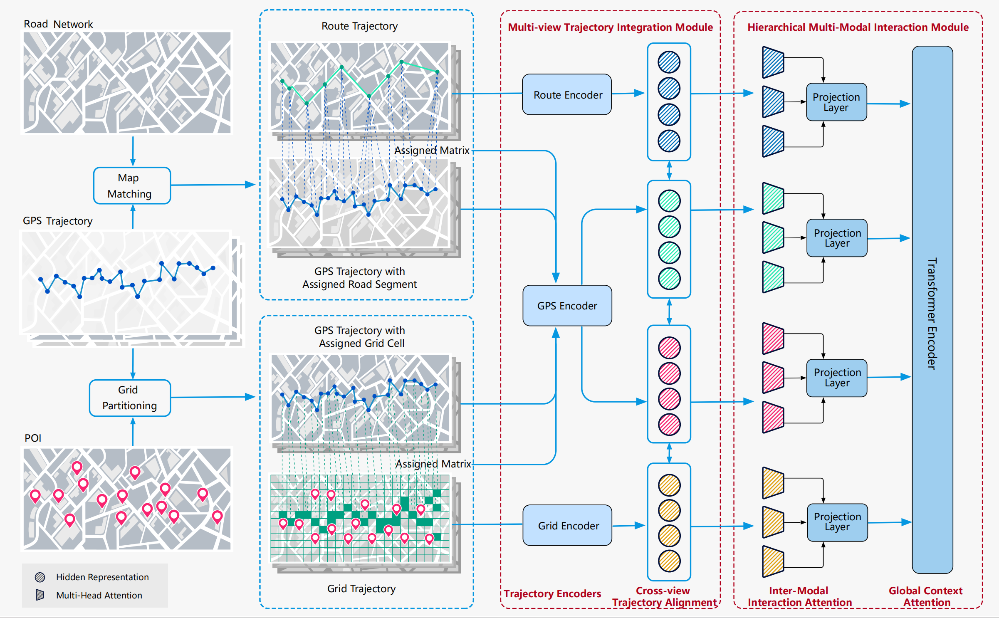

# Context-Enhanced Multi-View Trajectory Representation Learning: Bridging the Gap through Self-Supervised Models

This is a PyTorch implementation of Context-Enhanced Multi-View Trajectory 
Representation Learning: Bridging the Gap through Self-Supervised Models[(**MVTraj**)](https://arxiv.org/abs/2410.13196)
for trajectory representation learning as described in our paper

## Requirements
Our code is based on Python version 3.7 and PyTorch version 1.8.1. And other dependencies are given in requirement.txt.

## data
We conduct our experiments on two trajectory datasets: Xi'an and Chengdu. The original data was provided by [**JGRM**](https://doi.org/10.1145/3589334.3645644), and we further processed it by incorporating Points of Interest (POI) data to enrich its features.You can get the data [**here**](https://pan.baidu.com/s/1Hgj0ykAnK09CQTBrmXK1Dg?pwd=citq).

## Code Structure
You can find our pretraining code in `model_train.py`, and the model architecture is defined in `MVTraj.py`. Before running the pretraining process, ensure that the `xx.json` configuration files in the `config/` folder are correctly set.
After pretraining, you can evaluate the model using the tasks provided in the `downstream/` folder.